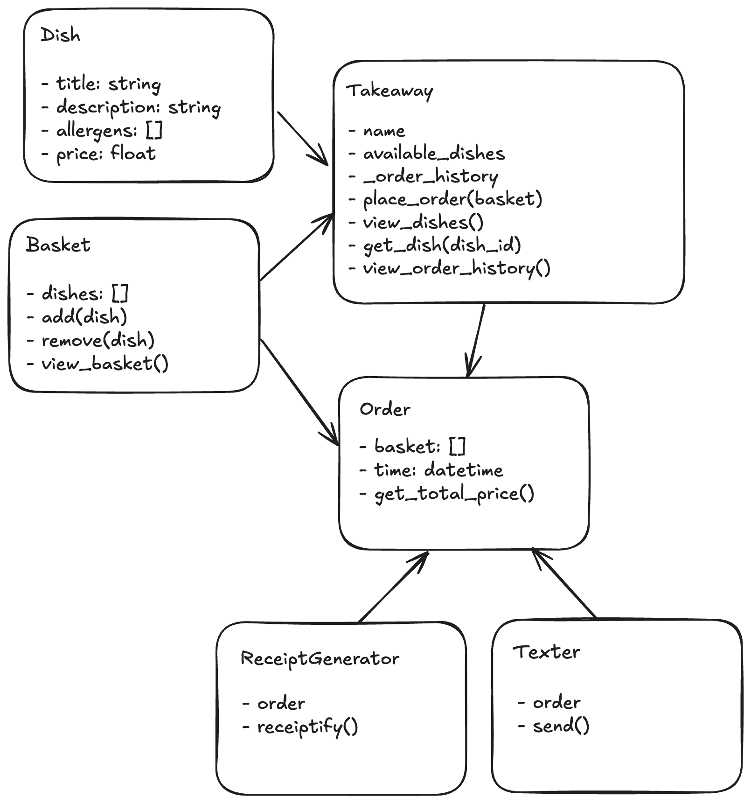

# Takeaway Project Design Recipe

## 1. Describe the Problem

As a customer
So that I can check if I want to order something
I would like to see a list of dishes with prices.

As a customer
So that I can order the meal I want
I would like to be able to select some number of several available dishes.

As a customer
So that I can verify that my order is correct
I would like to see an itemised receipt with a grand total.

As a customer
So that I am reassured that my order will be delivered on time
I would like to receive a text such as "Thank you! Your order was placed and will be delivered before 18:52" after I have ordered.

## 2. Design the Class Interface



```python

class Takeaway:
    def __init__(self, name):
        # name: string
        # menu: []
        # order_history: []
    def place_order(self, basket):
        # parameters:
        #   basket: []
        # returns:
        #   order object
    def view_menu(self):
        # returns:
        #   array of menu
    def get_dish(dish_id):
        # returns:
        #   gets dish object according to its id
    def view_order_history(self):
        # returns:
        #   array of order_history

class Basket:
    def __init__(self):
        # dishes = []
    def add(dish):
        # side-effects:
        #   adds dish to basket
    def remove(dish):
        # side-effects:
        #   removes dish from basket
    def view_basket(self):
        # returns:
        #   all dishes in the basket

class Order:
    def __init__(self):
        # basket = []
        # time: datetime
        # order_number: int
    def get_total_price():
        # returns:
        #   float of total order price

class Dish:
    def __init__(self):
        # title: string
        # description: string
        # allergens: []
        # price: 
        
class ReceiptGenerator:
    def __init__(self):
        # order: order object
    def receiptify(self):
        # returns:
        #   a dict with the following keys: {time_of_order, order_number, dishes, total_price}

class Texter:
    def __init__(self):
        #order: order object
    def send(self):
        # side-effects
        #   sends text e.g. "Thank you! Your order was placed and will be delivered before 18:52"

```

## 3. Create Examples as Tests

``` python

takeaway = Takeaway("Nandos")
takeaway.get_dish(45) # => object of dish with id 45

takeaway = Takeaway("Nandos")
dish1 = takeaway.get_dish(45)
dish2 = takeaway.get_dish(34)
basket = Basket()
basket.add(dish1)
basket.add(dish2)
takeaway.place_order(basket) # => order object

takeaway = Takeaway("Nandos")
dish1 = takeaway.get_dish(45)
basket = Basket()
basket.add(dish1)
basket.dishes # => [dish1]

takeaway = Takeaway("Nandos")
dish1 = takeaway.get_dish(45)
dish2 = takeaway.get_dish(34)
basket = Basket()
basket.add(dish1)
basket.add(dish2)
basket.remove(dish1)
basket.dishes # => [dish2]

takeaway = Takeaway("Nandos")
dish1 = takeaway.get_dish(45)
dish2 = takeaway.get_dish(34)
basket = Basket()
basket.add(dish1)
basket.add(dish2)
order = takeaway.place_order(basket)
takeaway.view_order_history() # => [order]

```